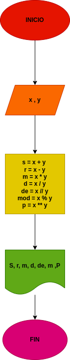

# Ejercicio N° 3

## Implementar un programapara calcular la suma, resta, multiplicacion, division, division entera, modulo y potencia

---
# ANALISIS

Variables de entrada (imput)

x & y: Numeros naturales utilisados para sacar el resultado de las operaciones

Variables de proceso y salida (Processing, storage, output)

---

s: Suma

r: Resta

m: Multiplicacion

d: Division

de: Division Entera

mod: Modulo

p: Potencia

---
# DISEÑO

# CONSTRUCCION